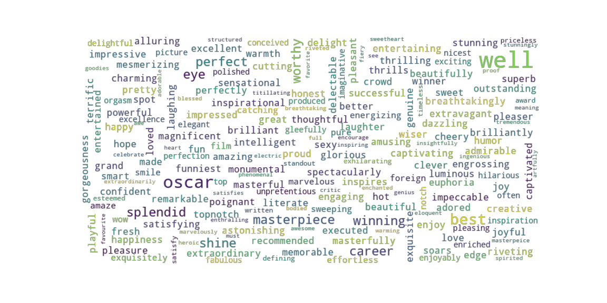

## Sentiment Classification on RTMovies sst-5. 

#### Introduction:

Imagine we have to fine-tune over 40 different variations of BERT-like language models. We want to do so in a reproducible way, so that we can go to any one of these models, with a simple click share it and it would run a precise copy of it on another machine. That is, replicate the environment, replicate the variables and replicate the data configuration. On top of this, we'd like to run experiments on these models, try different things, and change the way we feed data to these neural networks. We'd also like to do this on Google Cola Pro GPU instances. 

On the MLOps side: we're going to need a data versioning tool, an experiment tracker, and an orchestration tool. 
On the deep learning side, we're going to need a library that incorporates a zoo of these transformer models with a common interface so that we build a small neural network on top of it. We're going to need a library to allow us to easily train these models on GPU, a library that is hackable and would allow us to try unusual things, and that has an extensive list of callbacks.

How do we go about building this? Let me tell you what I've done!

For MLOps, I used **ClearML**. It's an end-to-end free open source solution that incorporates everything you need on the MLOps side of the machine learning lifecycle, from data-versioning to experiment tracking to orchestration to pipelines to hyperparameter optimization to deployment. All done intuitively with a machine learning first approach (unlike say, Airflow) with an amazing dashboard and GUI to boot!

On the deep learning side, I used **HuggingFace** for its zoo of transformers and easy-to-use interfaces. I also used **Pytorch Lightning** for training the neural networks with its vast library of the state of the art technique implementations. It's a wrapper on top of Pytorch, which means at any moment if you need more flexibility you can easily go down to the Pytorch level. Unlike bare Pytorch though, it guides you into best practices and saves you the writing of boilerplate code which helps prevent bugs. Overall, the library has a battery of quality-of-life features such as profiling, quick test run, automatic multi-GPU, and DDP training, easy-to-use logging, and useful callbacks for learning rate monitoring, model checkpointing, early stopping, network pruning, and many more.

#### The Data:
The data is the Rotten Tomatoes movie reviews sentiment tree-bank dataset. It has 5 classes:
 - 0 : Negative.
 - 1 : Slightly negative.
 - 2 : Neutral.
 - 3 : Slightly positive.
 - 4 : Positive.

Here is a wordcloud of the most frequent positive words:

Being a sentiment tree-bank means the reviews are decomposed into sequences of their constituent n-grams, which were then labeled separately. This implies there are a lot of single words (1-grams) in the data, the majority of which have neutral values, we need to account for this imbalance.

We can see this in the overall class distribution plot, where about half of the examples fall in the neutral category:

We can even see how the class distribution changes as the n-grams increase in size:

As expected the larger the text, the more uniform the distribution becomes among the classes.

##### Baselines:
We can establish some quick classification baselines. A purely random classifier would achieve:
$$P(y = k) = \sum_{j = 0}^{4} P(j)P(y = j) \approx 0.19 \\ \text{accuracy.}$$
Whereas a majority class classifier would achieve:
$$P(y = k) = P(k) \approx 0.50 \\ \text{accuracy}$$

##### Train/Val/Test splits:
To prevent target leakage we have to split the data in such a way that we preserve the entire tree for each review. That is, for each review either all of the tree is on the training set or the validation set, or the test set, where the pairwise intersection of these sets is empty. In other words, we cannot have nodes corresponding to a review in the test set appear in the training set.

Arbitrarily splitting the data, as the Kaggle competition did, would not result in a model that can correctly generalize.
The first step is to construct the training and testing sets, this is done in **test_data_split.py**. The data is retrieved from an S3 bucket and placed into a ClearML Dataset task and 20% of the total data is reserved for the test set. 
The split is done with the consideration above, and the seed is chosen such that the Wasserstein distance between the resulting distributions is minimized, to ensure that the testing data is representative of the training data.

##### Train/Validation splits:
This split is performed as part of the models_pipeline in **data_split.py**, the reason for this is to accomodate for various validation strategies if needed, such as k-fold cross validation, change the size of the validation split. It's performed as a ClearML task and the end result is uploaded to the Task as an artifact.
Statistics and plots for the splits are generated and stored in the Task aswell, for example, the distributions:

#### Training:
##### Base model:
In **base_model.py** We find the Pytorch and Pytorch-Lightning code necesary to train a 1-layer neural network on top of the representations learned from differnet BERT-based family of models, with diverse learning rate schedulers. It also calculates metrics such as accuracy, precision and recall with micro averaging for the latter to account for the class inbalances. It logs these metrics into TensorBoard which in turn gets picked up automatically by ClearML once we instantiate the Task.

This module also contains the Tokenization logic, the DataLoader logic and an optional Sampler class which allows us to generate maximally informative stratified mini-batches.

This module is ran as a ClearML task and remotely queued for execution in a GPU instance by a ClearML agent.

#### Pipeline:
The pipeline consists on reading **models.txt** and injecting them through ClearML parameter override into the **base_model** Task. It will automatically generate the different Task needed and schedule them accordingly in the GPU instances.
I used 4 Google Colab Pro GPU instances as ClearML agents (it's very easy to set them up).

#### Results:
The pipeline was ran multiple times, the most succesful models (according to differnet metrics) were iterated upon. Here are some of what I consider the best results (it's subjective according to which metric you'd like to optimize for).

#### The goal:
I wanted the model to be able to predict the sentiment of new reviews. Since the test-set is also a sentiment tree-bank, this is a bit tricky since the majority class tends to dominate if trained carelessly.

##### Accuracy:
In my opinion, this is a bad metric to optimize in this case. The highest achieved accuracy was $$0.67$$ on a single model. It was a bert-based-uncased pre-trained model previously fined tuned on an sst-2 task, specifically: _echarlaix/bert-base-uncased-sst2-acc91.1-d37-hybrid_.
In order to optimize for accuracy, a simple random DataLoader is needed. I.e samply the mini-batch data randomly from the training set.
The problem is this:

As we can see, this form of sampling in which the dominant class 2 is also dominant in the mini-batch results in an enormous centrality in the confusion matrix. Yes it achieves high accuracy, but it does so by not taking any chance on the sentiment classifier and preferring when in even the slightest doubt, to err on the majority class.
With the exception of the _slightly positive_ and _neutral_ class, it doesn't classify any other class over 50% of the time.

##### Precision/Recall:
This is a more suitable metric. In order to optimize for these metrics, or their geometric mean the F1 score, we need to incorporate the stratified sampling approach, the optimal strategy in this case is to train for 4 epochs with stratified mini-batches and 2 more epochs with regular random mini-batches. 
This results in more balanced results:

It achieves better results, but still struggles significantly with extreme sentiments and it also errs incorrectly. It classifies for example, 20% of the slightly negative sentiments as slightly positive.
I would prefer a model that errs more consistently. I.e missclassify to it's neighbors (slightly negative to neutral or negative).

##### Best:
The best model, in my opinion, is not one that optimizes any one given metric, but one which attempts to reach 50% precision in all classes, and errs correctly. The strategy to train such a model is to train with 4 epochs of stratified sampling, then train for another 4 epochs with alternate sampling (i.e 1 epoch random then 1 epoch stratified).

As you can see, the model achieves over 50% precision in all classes except _slightly negative_ . But it also errs in blocks, i.e it missclassifies to its neighbor.
This model doesn't particularly reach a high accuracy nor is it in the top 10 (of the 37 models) when it comes to precision and recall.

It's a case study that sometimes, what we're looking for cannot be surmised in a single number and blind adherance to single number metric optimization won't get us there.
Thankfully ClearML and Pytorch-Lightning made the logging of the confusion matrix incredibly easy and allowed us to find this little model which turned out to be a variation of the model that maximized accuracy: _echarlaix/bert-base-uncased-sst2-acc91.1-d37-hybrid_.

#### Improvements & Future Work:
The best way to improve the models would be to get more data, specifically data that reflect what we want to optimize for. Actual movie reviews, not necessarily from a sentiment tree-bank.
Some gain can be had by using data augmentation techniques for NLP.

Percluding the data optimization, we can improve the models in a few ways:

##### Low risk:
We can build ensambles of the best performing models. We can do so not just by averaging their outputs, but I believe better results can be achieved by concatenating the learned text representations of these models and using a character based neural network (for example: a small conv-net) to look for patterns in these representations.

#### Higher risk:
Pseudo-labeling.
We can, if desperate enough for a bit more of performance: construct ensambles by adding highly confident predictions from the test dataset back into the training set and re-train the model on the new set. This runs the risk of overfitting, but if done right can improve the statistical power of the model.

#### Efficiency:
If we'd like the model or the ensamble to be computationally efficient, then pruning techniques is the way to go. Pytorch-Lightning incorporates callbacks and state of the art pruning strategies (such as the lottery ticket hypothesis) that will find a sparse model which performs just as well as its dense counterpart.

